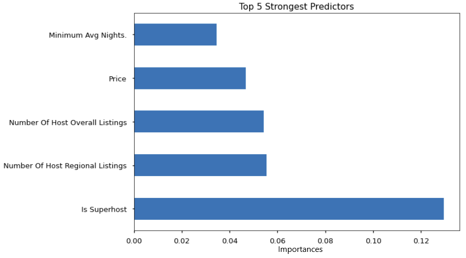

# Supporting the Hosts of Airbnb

**Author**: Ben McCarty

---

# **Overview**

**In a post-COVID world, hospitality faces challenges as travel restrictions are imposed and lifted (and then re-imposed).** Travel and tourism came to a crashing halt in 2020 and still face challenges in returning to pre-2020 business levels.

As restless travelers look to escape the confines of their homes, they expect the same high-quality services and experiences as pre-COVID. Competition within the hospitality industry is stronger than ever, putting more pressure on businesses to regain, retain, and expand their guest ledgers.

***The main performance metric for every company involved in hospitality is guest satisfaction.*** If a guest isn't satisfied, they are less likely to return for another visit and may share their experience with others, pushing away potential business.

Airbnb hosts face the same challenges as traditional hotels in these aggressive and challenging market conditions. In order to maximize their profitability and to distinguish themselves from traditional hotels, **Airbnb needs to know which aspects of a host property are the strongest predictors of whether a guest will give a satisfaction score of 4.8 or higher (out of 5).**

---

# **Data:**

With the question of how to predict high satisfaction scores in mind, I obtained data about Airbnb host properties from the [Inside Airbnb project](http://insideairbnb.com/get-the-data.html#:~:text=Washington%2C%20D.C.%2C%20District%20of%20Columbia%2C%20United%20States) for the Washington, D.C. area.

The dataset includes:
* Details about the hosts (when they started hosting and host-provided bios)
* Property details (bedrooms, bathrooms, and room/property types)
* Booking details (price, availability, and min/max number of nights)

---

# **Methods:**

I started my analysis with basic statistical overviews, identifying several columns of irrelevant data (URLs; details about how/when the data was collected; etc.). Additionally, I found  large percentages of property listings that lacked 6 or more entries and several features that were missing 25%+ entries. Due to the substantial amount of missing data, I chose to drop those rows and columns.

*Additional steps in the cleaning and preparation process included:*

* Converting "t"/"f" letters into 1/0 values to represent True/False values.

* Converting "price" from text into a number.

* Creating a new feature, "Years Hosting," to indicate number of years of hosting experience for each listing.

* Splitting the long text strings of host verification methods, neighborhoods, and amenities into separate features for each method, neighborhood, and amenity, respectively.

**After preparing the data, I used machine learning modeling techniques to determine my most important features for the region.**

---

# **Results:**

The "Random Forest"-style classification model showed the strongest performance in terms of properly identifying whether a property would meet the threshold of 4.8 or higher. The model is correct 67% of the time, which is better than my baseline model of 50%.

> Potential factors for the inaccuracy may include:
>* Extreme values in the data
>* Non-standardized amenity names (unique amenity names are treated individually vs. grouped with similar amenities)
>* A slight class imbalance (roughly 40% of the data fell below the threshold, with 60% above).

**The 5 top predictors are:**

1. Superhost Status
2. Regional Listings
3. Overall Listings
4. Price
5. Minimum Average Nights


## Visualizing Results



---

# **Recommendations:**

Based on my model results, I would recommend for Airbnb to focus its efforts on converting hosts into "Superhosts:"

>* "Superhosts are experienced hosts who provide a shining example for other hosts, and extraordinary experiences for their guests." [Source](https://www.airbnb.com/help/article/828/what-is-a-superhost)

Superhosts must meet the [following criteria](https://www.airbnb.com/help/article/829/how-do-i-become-a-superhost#:~:text=Earning%20Superhost%20status-,Superhost%20requirements,-Completed%20at%20least):
>* Complete at least 10 trips OR completed 3 reservations that total at least 100 nights
>* Maintain a 90% response rate or higher
>* Maintain a 1% cancellation rate (1 cancellation per 100 reservations) or lower
>* Maintain a 4.8 overall rating 

These requirements are more readily achievable than having a host offer additional listings, which would often require purchasing new properties. Furthermore, these requirements directly translate to high guest satisfaction. In my experience as a hotelier, being responsive and welcoming to guests are two of the most critical traits to ensure satisfaction. 

---

# **For More Information**

Please review the full analysis in [the Jupyter Notebook](./Helping_Your_Hosts.ipynb) or the [presentation](./Helping_Your_Hosts.pdf).

For any additional questions, please contact:

**Ben McCarty**

* [Email](mailto:bmccarty505@gmail.com)

* [Linkedin](www.linkedin.com/in/bmccarty505)

* [Github](https://github.com/BenJMcCarty)

# Repository Structure

```
├── README.md                           
├── Helping_Your_Hosts.ipynb
├── DS_Project_Presentation.pdf
├── data
├── clf_functions
└── img
```